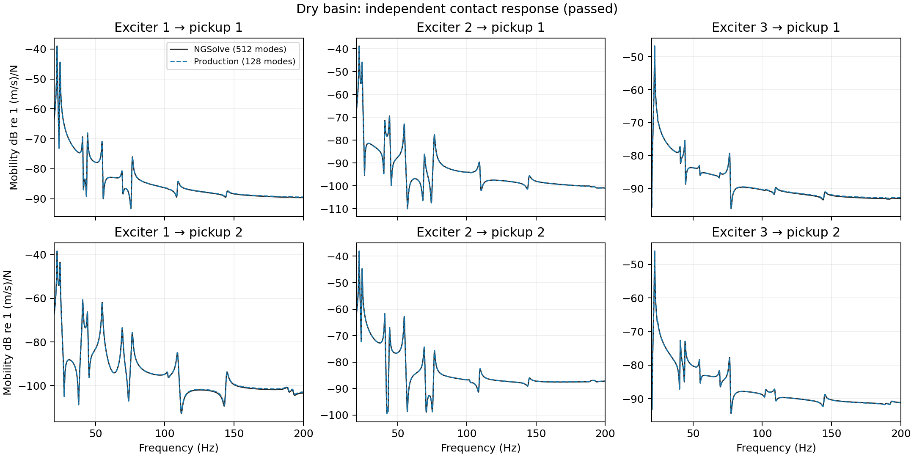
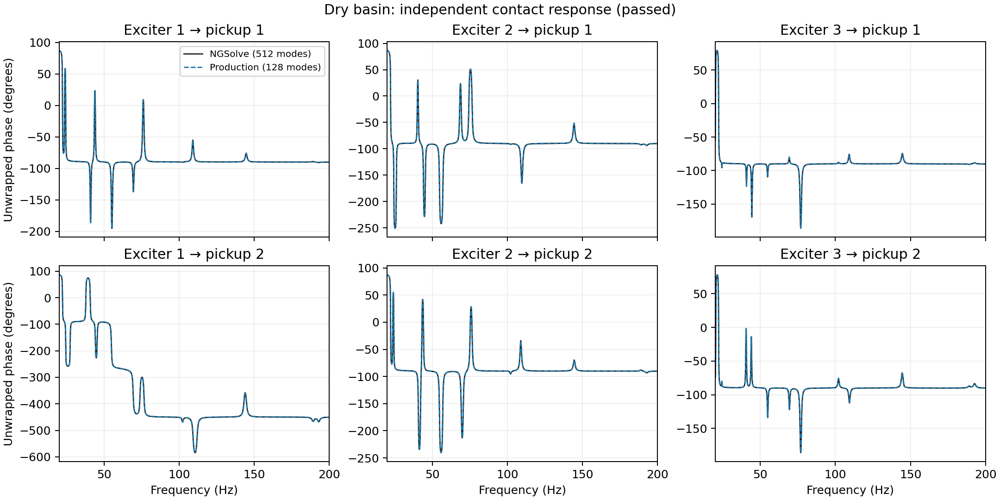
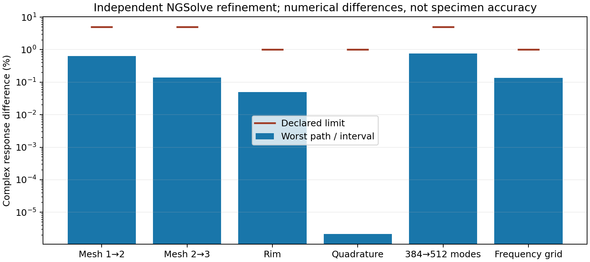

# Independent NGSolve validation — 8 October 2026

**Passed for the provisional dry basin over 20–200 Hz.** NGSolve independently
assembled the shell, passed its analytical plate prerequisite and refinement
checks, then agreed with the production `contact_200hz` model on all six contact
paths. The largest matched frequency difference is **0.0840%**; the minimum
mode-subspace MAC is **0.9999975**. Nineteen reference modes were compared,
including the next complete cluster beyond the requested band.

The result establishes numerical agreement for the stated linear shell and
mounting assumptions. It supplies no measured vessel calibration, water loading,
hydrophone pressure or full audible-band prediction. Physical calibration remains
deferred.

## Contact responses

Each path is metal point vertical velocity divided by a total unit force over an
exciter patch, in `(m/s)/N`. The production bank retains 128 modes; the independent
bank retains 512. Both use the configured damping ratio 0.005. Comparison preserves
raw complex values, with no fitted gain, phase alignment or interpolation. The
harmonic convention is `exp(+i*2*pi*f*t)`.

The table reports the worst relative complex L2 difference among the six paths
in each interval, with the independent response as denominator. Each criterion
must pass separately; a strong low resonance cannot hide upper-interval error.

| Interval (Hz) | Worst path difference | Declared limit | Result |
| --- | ---: | ---: | --- |
| 20–200 | 5.1642% | 10% | Pass |
| 20–40 | 5.1689% | 10% | Pass |
| 40–80 | 5.3863% | 10% | Pass |
| 80–160 | 2.6431% | 10% | Pass |
| 160–200 | 4.2938% | 10% | Pass |





Phase is unwrapped for display only; the comparison uses the original complex
data. Magnitude plots use dB relative to `1 (m/s)/N`, with a display floor of
`1e-15 (m/s)/N`.

## Independent reference checks

The six analytical plate frequencies have a maximum relative difference of
`2.63e-9`, below the declared 0.5% tolerance. This verifies that particular flat
plate prerequisite; it is not an accuracy estimate for the basin.

| Refinement | Worst path/interval difference | Declared limit | Result |
| --- | ---: | ---: | --- |
| Basin mesh 1 → 2 | 0.6352% | 5% | Pass |
| Basin mesh 2 → 3 | 0.1386% | 5% | Pass |
| Rim 64 → 128 arcs | 0.0500% | 1% | Pass |
| Additional quadrature order 6 → 8 | 0.00000218% | 1% | Pass |
| Modal bank 384 → 512 | 0.7549% | 5% | Pass |
| Denser frequency grid | 0.1365% | 1% | Pass |

Mesh/rim/quadrature frequency and shape comparisons also pass: frequency
differences are below 0.25%, and subspace MAC exceeds 0.995. Matrix symmetry,
eigenproblem residual and modal mass orthogonality checks pass before export.
These finite refinement criteria do not provide rigorous continuum error bounds.



## Geometry correction and retained failure

The first runtime check exposed incorrect rim classification: a Netgen edge index
identified a geometry segment rather than a boundary condition. This constrained
only one edge of the prerequisite plate. Boundary classification now uses the
edge descriptor's outside domain, preserving internal contact interfaces.

After that correction, the initial straight-polygon basin run still **failed**:
successive mesh response differences reached 21.57% and 5.48%; separate rim
refinement reached 1.38%. Although its frequencies and production-response
comparison passed, it was not accepted as a converged external reference. Its
[historical report](external/linear_rim_report.json) is retained with its original
source hashes; it does not describe the current solver source.

The current default uses quadratic spline arcs for the ellipse and second-order
mesh geometry. A degree-six lift represents the cubic graph composed with the
quadratic XY map, including its normals. Mechanical displacement remains cubic;
moment and Regge spaces remain quadratic. This improves boundary accuracy without
requiring an excessively fine straight-rim mesh. No acceptance tolerance changed.

| Basin mesh | Maximum mesh length (m) | Rim arcs | Mixed DOFs |
| --- | ---: | ---: | ---: |
| 1 | 0.120 | 32 | 15,303 |
| 2 | 0.085 | 48 | 18,981 |
| 3 | 0.060 | 64 | 28,107 |

The separate rim check doubles the final arc count to 128. Its physical-area
and contact laws remain those in the [request](external/request.json): the free,
5 mm stainless-steel graph, four springs on mean patch translation, rigid exciter
housing masses on mean XYZ translation, and point global-Z velocity pickups.
There is no shear, rotary inertia, adhesive compliance, prestress or added fluid.

## Reproduce and inspect

Executed with NGSolve **6.2.2608**, SciPy **1.18.1** and NumPy **2.2.6**.
From the repository root, with these optional dependencies installed:

```bash
OPENBLAS_NUM_THREADS=1 OMP_NUM_THREADS=1 python tools/validate_external_dry_basin.py
python tools/plot_external_dry_basin.py
```

The plotting helper also needs Matplotlib (`python -m pip install -e '.[paper]'`).
The solver is an offline research check; cached audio/Blender playback still needs
neither NGSolve nor SciPy. To investigate the earlier straight boundary, use
`--geometry-order 1 --rim-segments 64 128 256 --output data/fem/001_resonant_surface/external_solver_linear_replay`.
Changing parameters or discretization requires a fresh study.

The [full report](external/report.json), [provenance](external/provenance.json),
five modal archives and [raw complex curves](external/contact_responses.npz) are
curated beside the paper. Source, request, modal-data and figure hashes are recorded.
Complete generated CSVs and caches remain in ignored
`data/fem/001_resonant_surface/external_solver/`. Exit status 0 requires every
prerequisite, refinement and production comparison gate to pass.

Method and tolerances: [study README](../../../studies/plates/003_external_shell/README.md).
Broader interpretation: [working paper](paper.md#59-independent-ngsolve-results).
The implementation follows NGSolve's
[HHJ/Regge shell formulation](https://docu.ngsolve.org/ngs24/SaS/linear_KL_RM_shell_HHJ_TDNNS.html).
