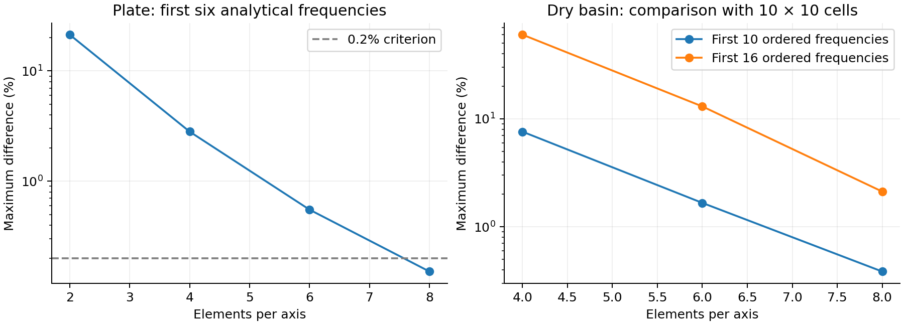
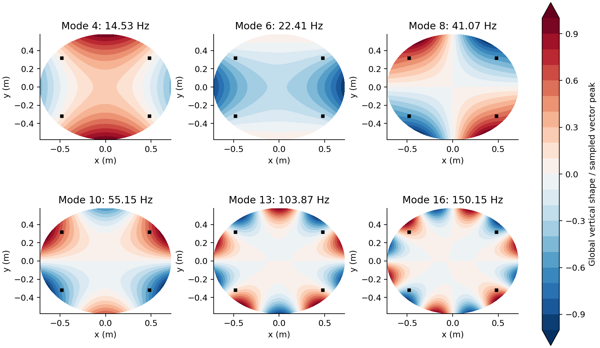
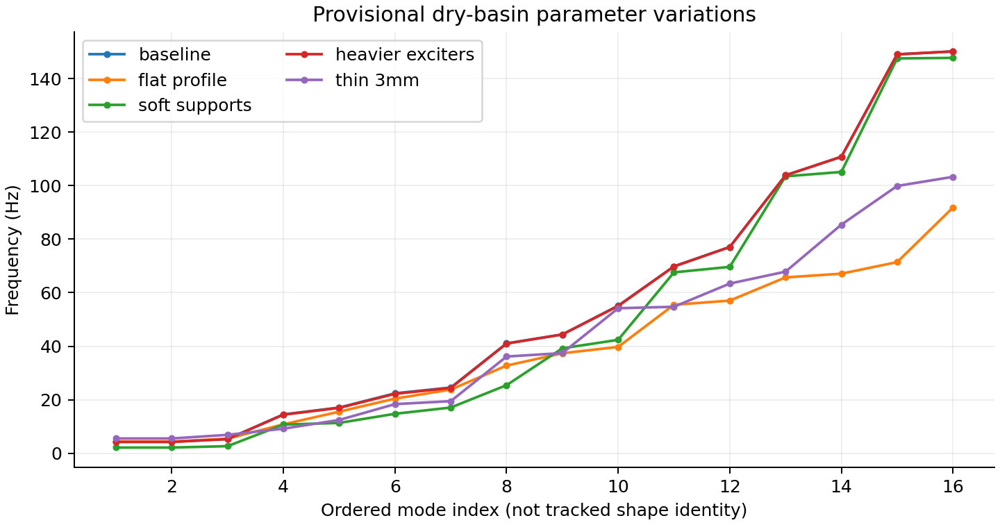
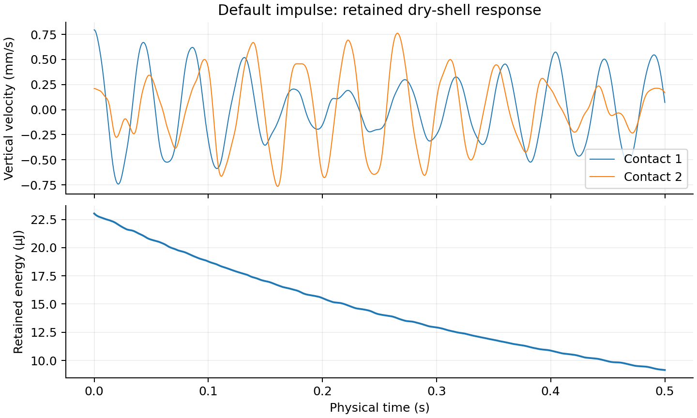
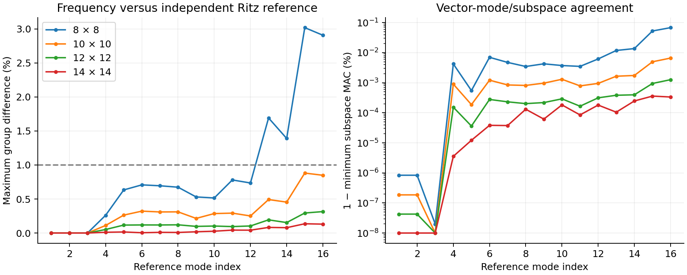
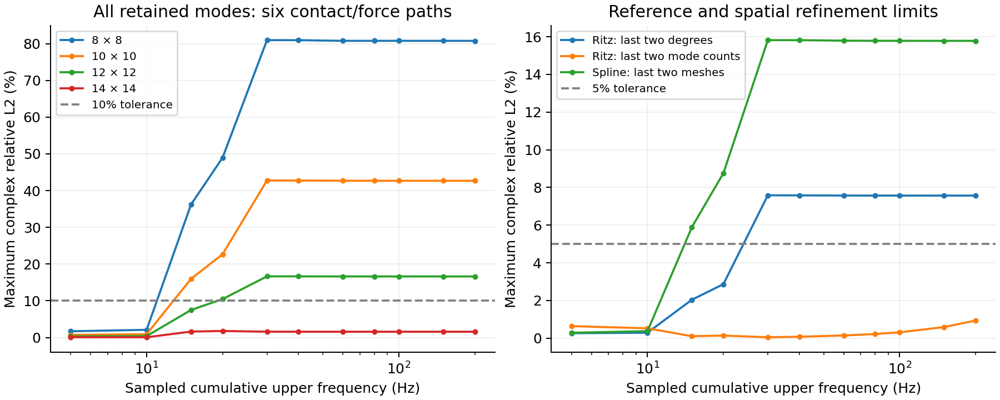
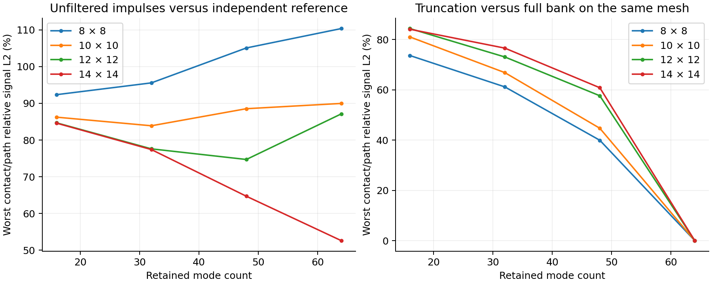
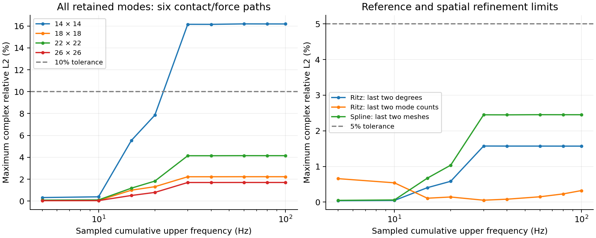
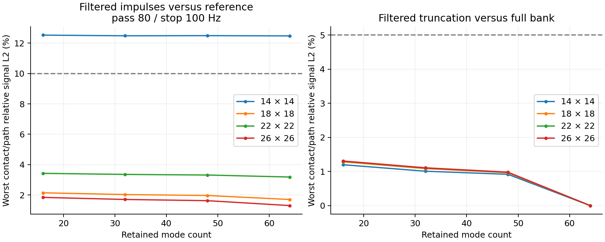

# From a plate reference to a dry resonant basin: numerical modes and shared audiovisual state

**Working technical paper, version 0.3 — 7 October 2026**

Project: Spatial Sculptures. Authorship and publication venue remain open.
This is a computational study with provisional parameters, not a calibrated vessel
model or a demonstrated spatial-audio installation. It extends the
[analytical plate paper](../modal_reference/paper.md).

## Abstract

A spatial-audio sculpture may derive its behavior from vibrating materials rather
than conventional speaker panning. Following a verified analytical flat-plate
reference, we implement a configurable dry curved metal basin with four compliant
supports and rigid exciter housing masses. A small linear Kirchhoff–Love shell
discretization uses smooth tensor-product spline functions, consistent mass and
covariant membrane/bending energy. Its flat rectangular reduction reproduces six
analytical frequencies within 0.152% on an 8 × 8 cell mesh. The provisional curved
basin has sixteen retained modes between approximately 4.30 and 150.15 Hz, including
low-frequency supported body motion. Comparing 8 × 8 with 10 × 10 cells changes the
first ten ordered frequencies by at most 0.385%, and all sixteen by 2.12%. These
differences do not establish an error bound or specimen accuracy. Cached modes
feed one modal response from which Python generates both contact-velocity audio
and Blender displacement frames. A synchronized export shares physical time;
magnification and exposure averaging remain explicit presentation choices. Water
loading, pressure, acoustic radiation and closed feedback are outside this study.

The expanded study adds an independently assembled polynomial Ritz reference and
contact-signal convergence tests. The default model has frequency-only evidence
through about 76.54 Hz, but meets all sampled contact-transfer criteria only through
10 Hz. Further refinement with stable reference evaluation establishes a sampled
contact-transfer band through 100 Hz for an 18 × 18 mesh and sixteen retained modes.
Worst complex-transfer and identically filtered impulse differences are approximately
2.4% and 2.1%, respectively. Listening uses a documented 80 Hz pass band / 100 Hz
stop band. Unfiltered sixteen-mode impulses remain unconverged. These are numerical
cross-verification results within shared assumptions, not physical vessel accuracy.

## 1. Purpose and relationship to the sculpture

The intended object is a water-filled resonant metal basin with contact exciters,
hydrophones and controlled droplets. Its first Blender prototype uses an artistic
radial-wave field. Its optional SuperCollider sketch maps field-control values
to synthesis; it is not a pressure signal generated by a coupled acoustic model.

The analytical plate reference established force/impulse units, modal response,
energy and contact sensing. It did not represent curvature or the four local
supports. This study introduces those structural effects before fluid coupling.
Profile, thickness, support stiffness/positions, patch sizes and attached masses
are editable, reproducible assumptions. Final fabrication choices are not required
to explore them, but physical validation requires measurements later.

The implementation claim is limited: numerical structural modes and a shared
physical response replace decorative geometry with unrelated frequencies. It
does not claim a new shell formulation, a general-purpose FEM package or a correct
prediction of how the eventual sculpture will sound.

## 2. Model and provisional parameters

The stress-free midsurface is the graph r(x,y) = (x,y,z(x,y)) over an ellipse,
with X = x/rₓ and Y = y/rᵧ:

$$z=z_0+H(X^2+Y^2)+A X(1-X^2-Y^2),\qquad X^2+Y^2\leq1.$$

| Quantity | Baseline | Interpretation |
| --- | --- | --- |
| Radii rₓ, rᵧ | 0.72, 0.58 m | Elliptical plan, approximately 1.4 m wide |
| Rise H, asymmetry A | 0.12, 0.006 m | Configurable smooth fabricated-vessel approximation |
| Uniform thickness h | 0.005 m | Provisional; no thickness map |
| E, ρ, ν | 193 GPa, 8030 kg/m³, 0.30 | Stainless-steel-like assumptions |
| Support centres | x = ±0.48, y = ±0.32 m | Four patches, 35 mm wide |
| Total patch stiffness | (10, 10, 300) kN/m in global X/Y/Z | Independent translating springs |
| Exciter centres | (−0.34, 0.14), (0.31, 0.13), (0.02, −0.32) m | Three 50 mm patches |
| Exciter housing masses | 0.12 kg each | Rigid translational inertia |
| Damping ratio | 0.005 each mode | Phenomenological, not measured |
| Default impulse | 0.03 N·s at first patch, t = 0 | Prescribed mechanical event, not a drop model |
| Contact pickups | (−0.20, −0.04), (0.25, −0.10) m | Global vertical velocity of the metal |
| Water depth | 0 | Positive depth is rejected |

The material values carry over from the
[plate reference assumptions](../modal_reference/decisions.md), including its
manufacturer modulus/density source; Poisson ratio and damping remain unmeasured.
The computed midsurface area is 1.3572 m² and shell mass is 54.492 kg, with an
additional 0.36 kg of housing masses. These are model quantities, not weighings.
The large mass follows directly from the provisional 5 mm steel thickness.

The rim is mechanically free. A visually thickened Blender mesh does not add a
rim stiffener to the structural solve. Each contact patch acts through mean
translation; rotational foot restraint and adhesive/actuator compliance are
excluded. Gravity prestress, fluid, residual fabrication stresses, nonlinear
deformation, transverse shear and rotary inertia are excluded.

## 3. Structural formulation

### 3.1 Covariant energy

The implementation uses the membrane-plus-bending energy of a linear
Kirchhoff–Love shell. The compact surface formulation and flat-plate reduction
are given in the [NGSolve shell derivation](https://docu.ngsolve.org/ngs24/SaS/linear_nonlinear_shell_equ.html)
and its [plate derivation](https://docu.ngsolve.org/ngs24/SaS/plates_derivation.html).
The following is our coordinate specialization for the configured graph.

Let aᵢ = ∂ᵢr, gᵢⱼ = aᵢ·aⱼ, n be the reference unit normal and Γᵏᵢⱼ the reference
connection. For vector displacement u(x,y), the linear membrane and change-of-curvature
tensors are

$$\epsilon_{ij}=\tfrac12(a_i\cdot\partial_j u+a_j\cdot\partial_i u),$$

$$\kappa_{ij}=n\cdot(\partial_{ij}u-\Gamma^k_{ij}\partial_k u).$$

The inverse metric supplies physical contractions. For a symmetric covariant
tensor T, define the plane-stress energy norm

$$\|T\|_C^2=\lambda_2(g^{ij}T_{ij})^2
 +2\mu\,g^{ik}g^{jl}T_{ij}T_{kl},$$

$$\lambda_2=\frac{E\nu}{1-\nu^2},\qquad\mu=\frac{E}{2(1+\nu)}.$$

Then the elastic energy and kinetic energy are

$$U=\frac12\int_S \left(h\|\epsilon\|_C^2+
 \frac{h^3}{12}\|\kappa\|_C^2\right)dA,
\qquad T=\frac12\int_S\rho h|\dot u|^2dA.$$

The geometric Jacobian is included in dA. Exact graph derivatives determine the
normal, metric and connection. Curvature therefore changes both stiffness and
mass integration; it is not only a visualization setting.

### 3.2 Discretization, supports and housing inertia

Each Cartesian component uses the same cubic open-uniform, C²-continuous
tensor-product B-spline basis. Analytic first/second basis derivatives permit the
Kirchhoff–Love bending energy without adding rotation unknowns. The ellipse trims
the rectangular parameter domain. Cell integration clips intervals analytically
and splits at ellipse/grid intersections, rather than masking whole cells.
Quadrature order and mesh density remain study parameters.

For each square patch P, define a surface-area mean

$$\bar u_P=\frac{1}{|P|}\int_P u\,dA.$$

Its support energy is ½ Σₐ kₐ ū²ₚ,ₐ; a housing contributes kinetic energy
½ m |dūₚ/dt|². These idealizations add positive-semidefinite patch terms to K
and M. A prescribed total force F along a configured unit direction d projects
through d·ūₚ. Patch integration splits at spline knots. The same projection
defines the mounting mass, support translation and prescribed excitation.

The assembled problem is

$$K\phi_j=\omega_j^2M\phi_j.$$

Diagonal mass scaling and Cholesky whitening turn it into a symmetric standard
eigenproblem evaluated with [NumPy eigh](https://numpy.org/doc/stable/reference/generated/numpy.linalg.eigh.html).
Modes below 0.01 Hz are counted and excluded; a substantial negative eigenvalue
fails the solve. Modes and modal masses are renormalized together using the sampled
maximum vector displacement on a fixed integration grid, retaining consistent SI
coordinates and energy. This is sampled normalization, not an exact global maximum.

The baseline has 351 translational degrees of freedom and retains sixteen modes.
Dense matrices keep the implementation inspectable but limit large-mesh scaling.
Offline calculation is separate from playback. A cache key includes structural
parameters and numerical solver source hashes; changes to force, damping, pickups
or presentation reuse those modes.

## 4. Shared response, observations and presentation

The analytical plate and numerical basin share `ModalResponse`. For each mode,

$$M_j\ddot q_j+2\zeta_j\omega_jM_j\dot q_j+M_j\omega_j^2q_j=Q_j(t).$$

Exact impulse and switched harmonic solutions superpose in absolute physical
time. There is no separate integration clock inside Blender. The structure is
reconstructed as u = Σⱼ φⱼ qⱼ. A contact at p observes
vₚ = Σⱼ φⱼ,z(p) q̇ⱼ. Retained mechanical energy is
½ Σⱼ Mⱼ(q̇²ⱼ + ω²ⱼq²ⱼ), in joules.

```text
configurable structure → offline eigenproblem → cached modes
                                                │
                                      Python modal response
                                                │
                           ┌────────────────────┴────────────────────┐
                           ▼                                         ▼
                    vector displacement                       contact velocity
                           │                                         │
                  precomputed Blender frames                 48 kHz WAV / future DSP
                           └────────────────────┬────────────────────┘
                                        synchronized MP4
```

Two WAV channels represent two metal contacts. One shared listening gain preserves
their relative levels, but independently normalized runs cannot compare physical
loudness. No transfer from contact velocity to hydrophone pressure, listener SPL,
binaural perception or speaker spatialization is asserted.

Normal playback and exported video share time zero and duration. Visual motion is
magnified ×1500. At 30 FPS, audio-rate vibration cannot be shown as resolved motion;
the default picture averages displacement over half a frame. This inexpensive
temporal filter suppresses rapid oscillation and is not full optical motion blur.
It does not filter the audio. Slow inspection changes visual time separately and
deliberately omits the unretimed soundtrack. The exported MP4 uses the physical-speed
WAV and PNG sequence through [FFmpeg](https://ffmpeg.org/ffmpeg.html).

## 5. Verification and computed results

### 5.1 Independent flat-plate reference

For a flat rectangle, membrane and transverse bending decouple. Imposing w = 0
at all edges, with natural simply-supported bending conditions, gives an independent
reference with frequencies

$$f_{mn}=\frac{\pi}{2}\sqrt{\frac{Eh^3}{12(1-\nu^2)\rho h}}
\left[(m/a)^2+(n/b)^2\right].$$

The classical plate reference is [Leissa, NASA SP-160](https://ntrs.nasa.gov/citations/19700009156).
The numerical matrix assembly does not substitute these frequencies. Meshes of
2, 4, 6 and 8 cells per axis are compared with analytical frequencies and shapes.
On the finest mesh, the first six relative frequency errors are at most 0.1517%
and their area-weighted modal assurance values exceed 0.999991. Coarse ordered
modes can cross, so low-mesh shape matching is not universally successful.

Additional tests check partition of unity and derivatives, flat membrane energy,
six free-shell rigid motions, mass orthogonality, cache normalization/replay, and
the monotone eigenvalue effects of support stiffness and attached mass. These
checks address mathematical implementation, not measured vessel behavior.

### 5.2 Curved basin refinement

The first ten baseline frequencies are approximately 4.297, 4.297, 5.345, 14.528,
17.087, 22.411, 24.574, 41.067, 44.417 and 55.149 Hz; the six higher retained modes
extend to 150.147 Hz. The lowest modes include supported body motion, so the first
frequency should not be described as a pure metal bending fundamental.

Comparing 8 × 8 with 10 × 10 cells changes the first ten ordered frequencies by
at most 0.3847%, and all sixteen by 2.118%. Raising Gauss order from 5 to 7 on the
8 × 8 mesh changes them by at most 0.00189%. Integration refinement is therefore
smaller than the observed spatial-discretization difference in this example.
Near-degenerate shapes can rotate or exchange order. These are frequency comparisons,
not matched curved-mode accuracy bounds, and do not establish convergence of
the complete impulse signal or pickups.



Figure 1. Independent plate error and dry-shell differences relative to the finer
10 × 10 mesh. The basin comparison is not an independent exact solution.



Figure 2. Selected vector modes shown through their global vertical component;
black squares mark support centres. The color normalization is shared with the
stored sampled vector-peak convention, not a separate vertical normalization.

### 5.3 Reproducible parameter variations

Six named experiments preserve the solver while varying flat/curved profile,
support stiffness, housing mass, thickness or prescribed drives. Full configurations,
source hashes, frequencies, retained energy and unnormalized velocity peaks are
recorded in [results.json](results.json). The drive-only experiment reuses baseline
modes. Stiffening supports or adding inertia changes calculated frequencies through
K or M, respectively. The flat ellipse is distinct from the rectangular verification
plate and retains local springs.



Figure 3. Ordered frequencies across provisional structural variations. Mode indices
do not establish tracked shape identity across changed structures.



Figure 4. The baseline 0.5-second response in physical units before audio normalization,
with energy of the sixteen retained modes. This is not a broadband convergence claim.

### 5.4 Independent curved-shell cross-verification

The [polynomial Ritz reference](../../../studies/plates/002_curved_shell_reference/README.md)
implements the same configured elliptical graph with independent geometry evaluation,
basis, integration and matrix assembly. Global real Zernike polynomials replace
local splines; polar integration replaces clipped cells. Orthonormal tangent strains
and direct variation of the reference normal replace metric-contracted production
operators. Both solve the same stated Kirchhoff–Love physical model. This checks
implementation and discretization independently; it does not check the adequacy of
those shared physical assumptions against 3-D elasticity or a real specimen.

The disk-polynomial basis and stable evaluation methods are described by
[Greengard and Serkh (2018)](https://arxiv.org/abs/1811.02720). Version 0.2 evaluated
explicit Cartesian coefficients with a degree-20 cap. The current evaluator uses
a Jacobi three-term recurrence and its analytic derivatives, multiplied by a
Cartesian complex monomial. This avoids polar singularities at the origin.
Low-degree power-formula comparisons, orthogonality and analytic boundary
values/derivatives through degree 48 check the implementation. Degree 48 is a
resource cap, not an established reference accuracy limit.

The baseline comparison retains degrees 12, 16, 18 and 20, with production meshes
8, 10, 12 and 14 cells per axis. All configurations retain up to 64 modes for
comparison, with subsets of 16, 32 and 48 modes. The further refinement below uses
degrees 24/28/32/36 and meshes 14/18/22/26.

Correspondence maximizes the global area-weighted vector modal-assurance score,
with one distinct candidate per reference mode. Nearly degenerate reference modes
within 0.2% form a subspace. Weighted QR bases and singular values compare those
subspaces; the minimum squared principal cosine tolerates sign, ordering and
mixing of equivalent modes. Frequencies in each group are compared sorted.
This replaces reliance on sorted mode indices alone.



Figure 5. Frequency and vector-subspace differences against the degree-20 Ritz
reference. The default spline model passes the 1% frequency and 0.99 subspace
criteria for a prefix through reference mode 12, approximately 76.54 Hz. Some higher
default frequencies differ by approximately 3%. Shapes are substantially closer
than these frequency differences might suggest.

### 5.5 Contact-response convergence and usable bandwidth

Frequency agreement is insufficient for a lightly damped contact signal. For force
patch e and pickup p, the velocity/force transfer is

$$H_{pe}(f)=i2\pi f\sum_j
\frac{\phi_{j,z}(p)\,g_{je}}{M_j[\omega_j^2-(2\pi f)^2+
 2i\zeta_j\omega_j(2\pi f)]}.$$

All six two-contact × three-exciter paths retain their physical scale and complex
phase. Version 0.2 used a uniform 0.05 Hz grid. Current comparisons add points
around every reference/candidate resonance, with eight samples per estimated
half-power half-width. Trapezoidal weights preserve integration measure on this
nonuniform grid. Halving baseline spacing and doubling resonance density checks
interpolation error. For each cumulative cutoff B, the finer transfer is the
relative L2 denominator. Frequencies with both signals
silent produce zero error; a nonzero candidate with a silent reference is undefined
and cannot pass. Signals are not separately normalized or phase-aligned.

Declared criteria are: production frequency difference ≤1%, subspace score ≥0.99;
reference refinement frequency difference ≤0.25%, score ≥0.995; independent contact
transfer difference ≤10% on every path; and each reference, mesh or modal-truncation
transfer refinement difference ≤5%. A modal cutoff must include all modes and
degenerate groups intersecting the band. Every lower tested cumulative cutoff
must also pass. These are research criteria, not specimen accuracy guarantees.



Figure 6. The refined production model closely follows the finest Ritz transfer,
but its preceding mesh and the preceding reference still limit a convergence claim.
The default 8 × 8, 16-mode configuration supports only the tested cumulative band
**up to 10 Hz** under these criteria. At the 15 Hz cutoff, the default model's worst
path differs by about 36% in complex L2, despite small frequency differences.
The finest spline-mesh change is about 5.89%, exceeding its 5% criterion. Above
this range, reference refinement also exceeds its criterion. None of the tested
baseline mesh/mode configurations earns a larger supported band under its reference
and refinement sequence.

This result is stricter than the approximately 76.54 Hz frequency-only prefix.
The two conclusions concern different observables. It does not establish useful
audible-band contact accuracy. A supported transfer band would require appropriately
limited forcing/output; the current default WAV remains an unfiltered impulse signal.



Figure 7. Common-time two-second unit-impulse contact signals at 4096 Hz, without
listening normalization. The default sixteen-mode signals have a worst-path relative
L2 difference of about 92.36% from the finite 64-mode Ritz reference. This is a
difference between computed, truncated responses, not a measured physical error.
Adding modes on a coarse mesh does not necessarily reduce it: additional inaccurate
high-frequency phase and coupling can worsen agreement. The reference and retained
bank are finite, so full-band impulse convergence is not claimed.

Full data, criteria, matched groups and per-path failures are recorded in
[convergence.json](convergence.json), with a [readable table](convergence.md).
Validation success here means the tools correctly expose both passed and failed
accuracy checks; it does not mean the current sculpture model is accurate across
an audible bandwidth.

### 5.6 Refined contact bandwidth and practical playback

The [refinement report](contact_refinement.md) uses reference degrees 24, 28, 32
and 36 and production meshes 14, 18, 22 and 26. It preserves the baseline geometry,
material, mounting laws and damping. Existing tolerances remain unchanged. Extra
checks require each candidate's next-mesh response to differ by at most 5%, and
both increased quadrature order and denser frequency sampling to differ by at most
1%. The final mesh pair is still checked independently of candidate selection.
All lower tested cumulative cutoffs must pass. Transfer comparisons are also
repeated over 20 Hz to each cutoff above 20 Hz, so sub-audible supported body
motion cannot mask disagreement in the listening interval.

The smallest passing tested playback bank uses **18 × 18 cells and sixteen modes**.
The following are worst-path values at the 100 Hz cumulative cutoff; every one of
the six pickup/force paths contributes separately to the maximum.

| Observable/check | Relative L2 difference | Criterion |
| --- | ---: | ---: |
| 18 × 18, 16-mode transfer versus degree-36, 64-mode reference | 2.36% | ≤10% |
| Reference degree 32 → 36 | 1.57% | ≤5% |
| Reference 48 → 64 retained modes | 0.323% | ≤5% |
| Candidate mesh 18 → 22, full banks | 1.93% | ≤5% |
| Final mesh pair 22 → 26 | 2.45% | ≤5% |
| Production 16 → 64 retained modes at 18 × 18 | 0.839% | ≤5% |
| Production quadrature order 5 → 7, finest mesh | 0.0048% | ≤1% |
| Reference quadrature refinement | <0.00001% | ≤1% |
| Denser-grid interpolation check, selected bank | 0.0222% | ≤1% |
| Identically filtered two-second unit-impulse signals versus reference | 2.14% | ≤10% |



Figure 8. Contact-transfer agreement and reference/mesh/truncation refinement for
the expanded study. A cumulative band includes supported body modes below 20 Hz;
the 100 Hz result is not a certification of the whole audible spectrum.



Figure 9. Identically filtered, common-time impulses at every exciter, sampled at
4096 Hz for the study. Raw SI amplitude and phase are retained. The chosen
sixteen-mode bank's filtered difference is approximately 2.14%, while its unfiltered
impulse difference remains approximately 85.2%. The two observables have deliberately
different bandwidths; the filtered result cannot certify unfiltered playback.

Listening uses a symmetric Kaiser-windowed sinc FIR: pass band through 80 Hz,
transition to the stop band at 100 Hz. The empirical design follows
[SciPy's Kaiser method documentation](https://docs.scipy.org/doc/scipy/reference/generated/scipy.signal.kaiserord.html)
with a 90 dB design value and an 80 dB stop-band target; execution needs only
NumPy. Independent filter tests check the frequency response, channel ratios,
phase and absence of circular wrap. Linear FFT convolution compensates the FIR
delay and uses physical continuation beyond the requested end. It is noncausal
and can ring before an impact. Filtering is an observation operation; it does not
alter mechanical damping, displacement or retained energy. The mechanical video
keeps its exposure average and the common time origin. Output is 48 kHz stereo,
with one shared listening normalization gain and recorded raw/filtered SI peaks.

`--select-band 100` chooses the smallest tested DOF count and then the smallest
retained bank passing both transfer and filtered-impulse criteria. A saved profile
records the evidence digest. Export rejects stale sources or changes to structure,
contacts, force directions, damping or output bandwidth that invalidate the claim.
Ordinary configurations remain available for exploratory work without such a claim.

Assembly now multiplies only local spline supports in bounded point batches;
reference assembly also bounds quadrature batches. Dense K/M matrices and the
NumPy eigensolver remain. An [assembly-only measurement](assembly_performance.json)
on the same 18 × 18 structure reduced process peak RSS from about 1509 MiB to
84 MiB. The indicative single-run assembly times were 13.0 and 2.6 seconds;
concurrent checks ran during measurement, so these are not controlled speed
bounds. Matching larger cached banks can provide a smaller playback subset without
another solve. An optional [SciPy partial eigensolver](https://docs.scipy.org/doc/scipy/reference/generated/scipy.sparse.linalg.eigsh.html)
is isolated to offline work; SciPy was unavailable here, so that branch's numerical
runtime comparison is not claimed.

Contact-edge/centre knot insertion is configurable independently of physical
mounting laws. It refines tensor-product strips, and can add more DOFs than uniform
refinement. The selected profile uses uniform refinement. Further patch-refinement
studies must satisfy their own mesh and reference criteria.

## 6. Limitations and next research steps

Plate verification, rigid-motion checks and one shell refinement study cannot
validate all curved geometries, thicknesses or boundary conditions. In particular,
membrane locking must be investigated for thin curved shells. Casquero and Mathews
document that issue and a treatment for quadratic NURBS shells
([2023 preprint](https://arxiv.org/abs/2311.00101)); our cubic spline implementation
does not implement that treatment or claim universal freedom from locking.

The retained sixteen-mode impulse response is a restricted low-frequency model,
not a converged full-band sound. A larger mode count requires convergence of
patch response and pickup signals as well as frequencies. No measured damping,
rim reinforcement, support rotation, exciter compliance, electrical impedance or
nonlinear contact is present.

The refined contact study establishes a limited 100 Hz numerical transfer band.
Next, extend supported bandwidth and add a published curved-shell or external-solver
comparison with matching physical assumptions. Support/patch sensitivity and
thin-shell locking require further investigation across configurations.
Dry-vessel measurements can then fit geometry, support stiffness and damping. Water
coupling must subsequently represent fluid loading and pressure observations;
simply adding a drawn water surface or a depth setting is insufficient. Later DSP
feedback should consume actual simulated or recorded sensor signals. This preserves
the intended correspondence: metal/water → hydrophone → DSP → amplifier/exciter →
metal/water. Shared consumer state is an architectural goal, not proof of identical
virtual and physical sound.

## 7. Reproducibility

Implementation: [dry prototype](../../../prototypes/001_resonant_surface/dry/README.md),
[shell assembly](../../../src/spatial_sculptures/simulation/structures.py),
[shared response](../../../src/spatial_sculptures/simulation/mode_bank.py).
Numerical modes require NumPy; the original artistic field and scalar modal response
still support ordinary Python without it. Curated verification/results JSON and
PNG/PDF figures are versionable; generated caches, WAVs and render sequences remain
ignored. Source hashes detect stale results when plotting.

```bash
python tools/validate_structure.py
python tools/validate_dry_basin.py --output docs/research/dry_basin/convergence.json
python tools/plot_dry_convergence.py
python tools/run_dry_basin.py --preview --render
python tools/plot_dry_basin.py
```

See [validation.md](validation.md) for test results and full data-regeneration
commands. Blender/FFmpeg export was run; audible device and SuperCollider playback
were not evaluated in this environment.

## References

1. Leissa, A. W. (1969). *Vibration of Plates*. NASA SP-160.
   [NASA record](https://ntrs.nasa.gov/citations/19700009156).
2. NGSolve (2024 documentation). *Linear and nonlinear shell models*, §9.1.6–9.1.7.
   [Shell energies and reduction](https://docu.ngsolve.org/ngs24/SaS/linear_nonlinear_shell_equ.html).
3. NGSolve (2024 documentation). *Reissner–Mindlin and Kirchhoff–Love plates*.
   [Plane-stress/thickness reduction and boundary conditions](https://docu.ngsolve.org/ngs24/SaS/plates_derivation.html).
4. Casquero, H., and Mathews, K. D. (2023). *Overcoming membrane locking in quadratic
   NURBS-based discretizations of linear Kirchhoff–Love shells: CAS elements*.
   [arXiv:2311.00101](https://arxiv.org/abs/2311.00101).
5. NumPy developers. *numpy.linalg.eigh*.
   [Official documentation](https://numpy.org/doc/stable/reference/generated/numpy.linalg.eigh.html).
6. FFmpeg developers. *FFmpeg documentation*.
   [Official documentation](https://ffmpeg.org/ffmpeg.html).

7. Greengard, P., and Serkh, K. (2018). *Zernike Polynomials: Evaluation, Quadrature,
   and Interpolation*. [arXiv:1811.02720](https://arxiv.org/abs/1811.02720).

Online references checked 6–7 October 2026. BibTeX is in [references.bib](references.bib).
The NGSolve derivations support the mathematical model, not an endorsement or
validation of this implementation; NGSolve is not a runtime dependency.

7. Greengard, P., and Serkh, K. (2018). *Zernike Polynomials: Evaluation,
   Quadrature, and Interpolation*. [arXiv:1811.02720](https://arxiv.org/abs/1811.02720).
8. SciPy developers. *Kaiser window FIR design and partial symmetric eigenproblems*.
   [kaiserord](https://docs.scipy.org/doc/scipy/reference/generated/scipy.signal.kaiserord.html),
   [eigsh](https://docs.scipy.org/doc/scipy/reference/generated/scipy.sparse.linalg.eigsh.html).
