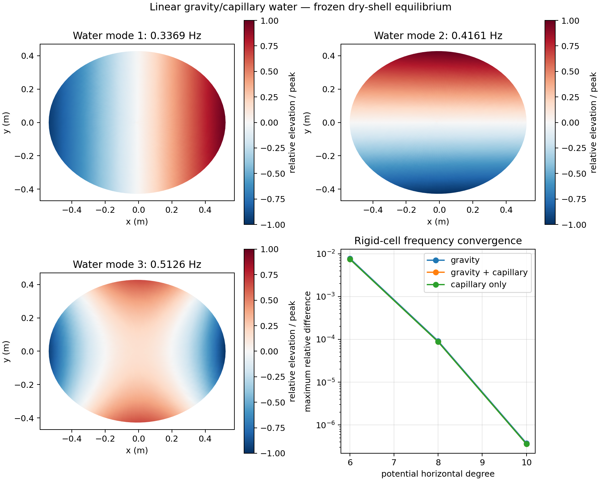

# Free-surface validation results

Recorded October 2026 with NumPy 2.2.6 and NGSolve 6.2.2608. The
[full numerical evidence](validation.json) passes the declared criteria for
the selected supported, frozen-shell gravity/capillary approximation. This is
numerical verification, without measured calibration or an independent curved
wet-vessel solve.

## Selected model

- Dry reference: `contact_200hz`, 18×18 spline shell cells, 256 dry modes.
- Fluid potential: total horizontal degree 12, vertical degree 3, 363 functions.
- Relative surface: degree 10, 65 zero-mean elevation functions.
- Resting water: 65 mm above the lowest point, 23.0534 litres, density 1000 kg/m³.
- Gravity: 9.81 m/s²; provisional surface tension: 0.072 N/m.
- Portable playback: 128 coupled modes, including water-dominated modes.
- Observation checks: separate 0–1, 1–3, 3–20, 20–40 and 40–80 Hz intervals.
- Listening filter: pass through 64 Hz, stop at 80 Hz, common zero-phase FIR.

Lowest six coupled water frequencies:

```text
0.336893, 0.416082, 0.512625, 0.535710, 0.641658, 0.646213 Hz
```



The [PDF](modes.pdf) is a standalone export. Mode shapes have independent
display normalization, without implying a physical excitation amplitude.
[Figure provenance](modes.json) records source/evidence/artifact hashes.

## Reference checks

Gravity-only, gravity/capillary and capillary-only rectangular cells pass
analytical mass, pressure and frequency comparisons. At horizontal degree 10,
the worst frequency difference is about **0.0000376%**, mass-matrix difference
**0.00000558%**, and pressure difference **0.00374%**.

The independent NGSolve rigid gravity/capillary cell passes three mesh levels.
At its finest 12,146-DOF mesh: frequency difference **0.000153%**, mass-matrix
difference **0.0000330%**, and pressure difference **0.00457%**. This check does
not validate the curved shell/fluid coupling or the omitted gravity operators.

## Basin convergence

Each entry below is the largest complex weighted-L2 relative difference over
six force/observer paths and all five checked intervals. Responses are in SI,
without separate peak/listening normalization.

| Refinement | Maximum difference | Declared limit |
| --- | ---: | ---: |
| Surface degree 8 → 10 | 4.1214% | 5% |
| Surface degree 10 → 12 | 2.0098% | 5% |
| Potential horizontal degree 10 → 12 | 1.4854% | 2% |
| Potential horizontal degree 12 → 14 | 0.5862% | 2% |
| Potential vertical degree 3 → 4 | 0.0102% | 2% |
| Finer horizontal/shoreline quadrature | 0.0021% | 1% |
| Dry subspace 256 → 512 | 0.0388% | 5% |
| Shell mesh 18×18 → 22×22 | 1.7812% | 5% |
| Shell mesh 22×22 → 26×26 | 2.2794% | 5% |

The lowest six water shapes and metal-dominated modes through 80 Hz pass
frequency/MAC correspondence checks. Across comparisons, the worst matched
frequency difference is about **0.0217%**, with minimum subspace MAC
**0.9999984**. High-order water modes have no uniform modal-spectrum claim;
the response checks cover the defined observation paths and intervals.

Selected fluid residual: `2.85e-12`; mass symmetry difference: `2.69e-13`;
linear volume-flux compatibility difference: `7.48e-17`. Its diagonally scaled
fluid condition number is large, `3.20e11`, making the refinement/reference
checks essential. Do not increase trial degrees indefinitely and rely only on
the equation residual.

## Playback convergence and runtime

Against the 512-dry-mode, full coupled reference, the selected 128-mode bank's
worst interval/path differences are **2.3398% pressure**, **0.4935% elevation**
and **1.9760% contact velocity**. The identically filtered finite-pulse pressure
difference is at most **0.2326%**. Doubling frequency-grid density changes
integrated response norms by less than **0.000635%**.

The saved portable archives total approximately 1.6 MB. Playback performs
modal observation calculations, without structural or fluid assembly. The
recorded six-second preview has 180 frames at 480×360/30 fps and two pressure
channels at 48 kHz. FFmpeg verifies a six-second video and audio stream.
Raw pressure and full frame states remain beside the MP4 in ignored renders.

Headless Blender 4.5.9 LTS builds successfully. Two consecutive builds leave
18 scene objects, one tagged callback and one audio strip. Deformed water
coordinates and frame pressure agree with the exported states. The picture
uses magnification and exposure averaging; it is not a complete observation
of every pressure/audio cycle. Higher retained modes also contribute to frame
states, without a validation claim above 80 Hz.

All 148 runnable unit tests pass; a UDP socket test is skipped by the sandbox.
The minimal environment without NumPy passes 64 ordinary-Python tests and
skips 85 optional numerical tests. Core imports do not require Blender.
Ruff and Python compilation pass. Earlier dry/wet numerical source hashes
remain current. SuperCollider is not required or used in this WAV/MP4 check.

## Reproduction and limits

```bash
OPENBLAS_NUM_THREADS=1 OMP_NUM_THREADS=1 python tools/validate_free_surface.py --external
MPLCONFIGDIR=/tmp/spatial-sculptures-matplotlib python tools/plot_free_surface.py
python tools/run_free_surface.py --preview --render
```

Read [the research note](study.md) before interpreting this as a physical
prediction. Hydrostatic equilibrium/prestress, elastogravity wall corrections,
viscosity, physical wetting/contact lines, localized droplets and acoustic
radiation are absent. No claim extends this wet model to the dry model's
200 Hz contact band. The saved source and artifact hashes gate verified
playback; a changed configuration requires fresh evidence.
