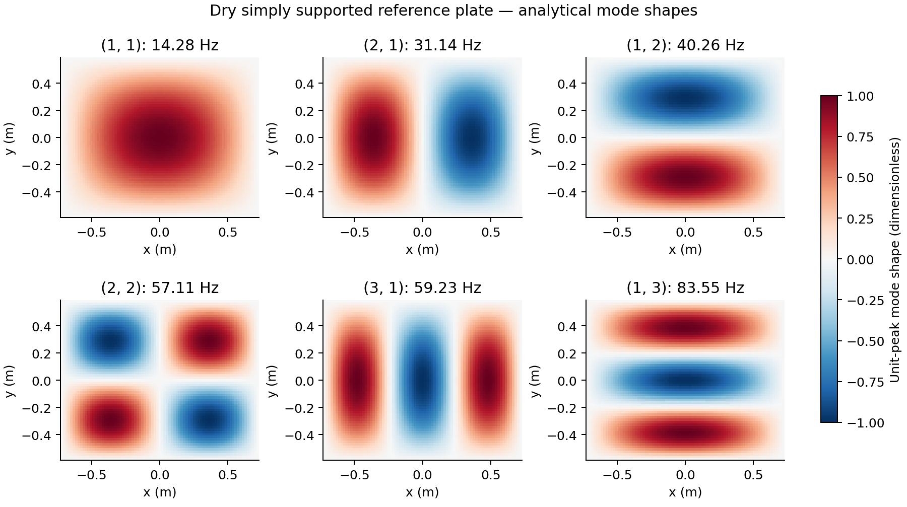
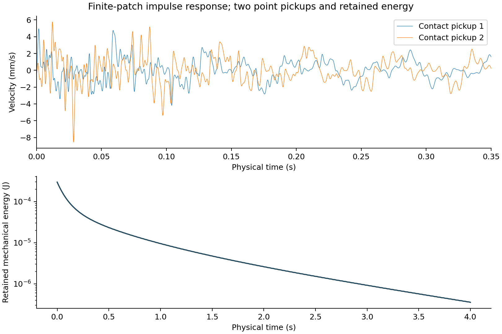

# Toward spatial audio through matter: a modal reference study for a resonant-surface sculpture

**Working technical paper, version 0.1 — 6 October 2026**  
Project: Spatial Sculptures. Authorship and publication venue remain to be decided.  
Status: computational reference study; no physical measurements or listener study.

## Abstract

This project asks whether spatial perception can emerge from the vibration and
acoustic behavior of sculptural materials. Its first proposed sculpture is a
shallow metal basin containing water, excited from below and sampled by
hydrophones. An initial artistic Blender field establishes geometry and interaction
ideas but supplies no structural or acoustic prediction. This paper documents the
first physical reference implemented alongside that prototype: a dry, homogeneous,
simply supported rectangular plate with a retained bank of analytical bending
modes. Finite-area impulses and harmonic forces produce modal displacement and
velocity; the same coordinates supply Blender inspection and offline contact-pickup
listening signals. Tests check boundary conditions, modal normalization, material
and dimension scaling, oscillator equations, and mechanical energy balance.
Provisional parameters give a fundamental frequency of 14.279 Hz and 36 retained
modes up to 514.026 Hz. Increasing the mode count changes retained impulse energy
substantially, so broadband convergence is not claimed. The reference establishes
an inspectable computational foundation; it does not predict the curved basin,
water pressure, acoustic radiation, or listener localization. These require later
models and physical validation.

**Keywords:** acoustic sculpture; modal synthesis; plate vibration; physical modeling;
virtual contact pickup; reproducible research.

## 1. Research question and scope

The artistic question is: *Can matter and space themselves become the spatial-audio
system?* The intended installation uses material vibration, water loading and
feedback as sources of spatial variation. Contact exciters drive the basin;
hydrophones receive underwater signals; SuperCollider processes these signals and
may eventually return excitation through amplifiers. The spatial outcome is a
hypothesis to investigate, not a demonstrated property of this software.

The existing `001_resonant_surface` prototype contains three exciters, two
hydrophones, a drip structure and an artistic interference field. Its independent
Python clock supplies snapshots to Blender and OSC. Its radial waves have separately
chosen frequency and wavelength, with a visual time scale; its hydrophones sample
water height rather than pressure. These choices remain useful for composition,
but they cannot establish a vessel's resonances or predict its sound.

The implemented study therefore begins with a different, explicitly bounded
object: a flat plate supported continuously along all four edges. This permits
analytical verification before a curved shell with four local supports is modeled.
The contribution is a reproducible connection between a research question,
explicit assumptions, SI-valued dynamics and consumer adapters. No new vibration
theory or novel physical solver is claimed.

## 2. Related work

Leissa's *Vibration of Plates* provides the classical reference for plate vibration
and boundary conditions [1](https://ntrs.nasa.gov/citations/19700009156).
Fletcher and Rossing place plates, shells and coupled vibrating systems within
musical acoustics [2](https://doi.org/10.1007/978-0-387-21603-4).

Modal sound modeling represents a vibrating object through damped oscillators and
location-dependent coupling. *FoleyAutomatic* demonstrates the use of such models
with contact interactions and graphics. Its geometric coupling and separation of
simulation from audio rendering motivate this project's approach; our implementation
does not reproduce its collision, friction or radiation models
[3](https://doi.org/10.1145/383259.383322).

Boundary assumptions deserve explicit treatment. Narita examines rectangular
plates with rotational edge springs, illustrating a route beyond idealized simple
supports. No spring-supported model is implemented here
[5](https://doi.org/10.25042/epi-ije.082024.03).

## 3. Physical reference and assumptions

| Parameter | Value | Provenance / interpretation |
| --- | --- | --- |
| Plate dimensions, a × b | 1.44 × 1.16 m | Current sculpture's envelope, made rectangular for the reference |
| Thickness, h | 0.005 m | Provisional value from sculpture configuration |
| Young's modulus, E | 193 GPa | Typical 304/304L product-sheet value |
| Density, ρ | 8030 kg/m³ | Typical product-sheet value |
| Poisson ratio, ν | 0.30 | Unmeasured assumption |
| Modal damping ratio, ζ | 0.005 for every mode | Unmeasured phenomenological assumption |
| Boundary | Simply supported on all four edges | Continuous edge support; free slope, zero displacement and normal bending moment |
| Retained indices | m, n = 1,…,6 | 36 modes; truncation is a research parameter |
| Excitation area | 50 × 50 mm square | Uniform transverse loading over a finite patch |
| Default impulse | 0.03 N·s at (−0.34, 0.14) m, t = 0 | Prescribed mechanical impulse; not a simulated droplet |
| Contact pickups | (−0.20, −0.04), (0.25, −0.10) m | Ideal point measurements of plate velocity |

The typical modulus and density come from the manufacturer's 304/304L data
sheet, not a measured specimen
[4](https://d1io3yog0oux5.cloudfront.net/_5ef3fcce137dc523a6c7a1e39a5194c2/clevelandcliffs/db/1190/10510/file/CLF_ProductData_304-304LSS_052021.pdf).
The material is treated as homogeneous and isotropic. Damping is not inferred
from that sheet. No fabrication, mounting or alloy purchase decision follows
from these provisional values.

Kirchhoff–Love theory assumes thin-plate bending and small deformation. The model
excludes curvature, membrane prestress, geometric nonlinearity, shear deformation,
rotary inertia, fluid loading and acoustic radiation. The reference rectangle has
a different area and support arrangement from the proposed basin. A model that
passes its tests is still not a validated model of the sculpture.

## 4. Mathematical formulation

### 4.1 Plate modes and normalization

Using centred coordinates, the plate occupies x ∈ [−a/2,a/2] and
 y ∈ [−b/2,b/2]. The flexural rigidity is

$$D = \frac{Eh^3}{12(1-\nu^2)}.$$

For the assumed support conditions, the transverse bending equation is

$$\rho h\,\frac{\partial^2 w}{\partial t^2}+D\nabla^4w=p(x,y,t).$$

The unit-peak sine-product basis and angular frequencies are

$$\phi_{mn}(x,y)=\sin\!\left[m\pi\left(\frac{x}{a}+\frac12\right)\right]
\sin\!\left[n\pi\left(\frac{y}{b}+\frac12\right)\right],$$

$$\omega_{mn}=\pi^2\sqrt{\frac{D}{\rho h}}
\left[\left(\frac{m}{a}\right)^2+\left(\frac{n}{b}\right)^2\right],
\qquad f_{mn}=\frac{\omega_{mn}}{2\pi}.$$

These follow by substituting the basis into the bending equation; the classical
plate setting is documented in [1](https://ntrs.nasa.gov/citations/19700009156).
With this normalization every retained mode has mass

$$M_{mn}=\rho h\int_A\phi_{mn}^2\,dA=\frac{\rho hab}{4}.$$

Thus the displacement approximation is

$$w(x,y,t)=\sum_{m,n} \phi_{mn}(x,y)q_{mn}(t).$$

No independent artistic wavelength or slowed physical clock appears in these
equations. Damping is added phenomenologically to each modal equation:

$$M_j\ddot q_j+2\zeta_j\omega_jM_j\dot q_j+M_j\omega_j^2q_j=Q_j(t).$$

### 4.2 Excitation and exact response

For a uniformly loaded square patch of side ℓ centred at (xₑ,yₑ), define

$$g_j=\frac{1}{\ell^2}\int_{\text{patch}}\phi_j\,dA
=\phi_{mn}(x_e,y_e)\,\operatorname{sinc}\!\left(\frac{m\pi\ell}{2a}\right)
\operatorname{sinc}\!\left(\frac{n\pi\ell}{2b}\right),$$

where sinc(z) = sin(z)/z. The entire patch must lie on the plate. A total force F
projects as Qⱼ = gⱼF. A total impulse J produces a velocity jump
Δq̇ⱼ = gⱼJ/Mⱼ. A finite spatial patch limits coupling to high-order modes;
a spatial point impulse would not provide a finite-energy infinite-mode limit.

For an impulse at t₀ and an initially stationary, underdamped mode, let
s = t − t₀ ≥ 0 and ωd,j = ωⱼ√(1 − ζⱼ²). Then

$$q_j(s)=\frac{g_jJ}{M_j\omega_{d,j}}
 e^{-\zeta_j\omega_js}\sin(\omega_{d,j}s).$$

Velocity is its analytical derivative. Multiple prescribed impulses superpose.
Optional harmonic drives use F cos(2πfₑs + θ), switched on at a specified time.
The implementation combines a steady harmonic particular solution with the free
transient needed for zero initial displacement and velocity. Undamped exact
resonance uses its finite-time secular solution rather than dividing by a zero
steady-state denominator. These are solutions of the retained linear system,
not numerical time-stepping approximations.

### 4.3 Observables and energy

Each ideal contact pickup reconstructs velocity:

$$v_p(t)=\sum_j\phi_j(x_p,y_p)\dot q_j(t).$$

This is a mechanical observation in m/s. It is neither underwater pressure nor
a prediction of airborne sound at a listener. The listening file is a normalized
representation of this signal. Acoustic radiation and transducer response remain
separate modeling tasks.

Mechanical energy of the retained bank is

$$\mathcal E(t)=\sum_j\frac{M_j}{2}
\left(\dot q_j^2+\omega_j^2q_j^2\right).$$

Between external impulses,

$$\frac{d\mathcal E}{dt}=\sum_j Q_j\dot q_j
-\sum_j2\zeta_j\omega_jM_j\dot q_j^2.$$

Unforced damped motion therefore loses energy; undamped unforced motion conserves
it. This joule-valued observable is stored in `ModalState.energy_joules`. It does
not reuse the artistic water field's mean-squared-height proxy or its OSC address.

## 5. Software and reproduction

Reusable material-independent modal response functions and analytical plate
helpers live under `src/spatial_sculptures/simulation/`. Geometry, excitation,
pickups and research defaults live in `studies/plates/001_modal_reference/`.
The existing sculpture and its artistic field remain a separate experiment.

The study's authoritative physical quantities are modal displacement and velocity.
Blender reconstructs the plate from these coordinates and the basis functions;
it does not evaluate the sculpture's radial-wave equation. Offline audio uses
those same coordinates at a 48 kHz sample rate. NumPy batches the exact formulas
when installed; the scalar core and a slower offline fallback use the standard
library. Neither path imports Blender.

```text
          physical reference model
              modal q(t), q̇(t)
                    │
          ┌─────────┴─────────┐
          ▼                   ▼
  Blender inspection    contact-velocity signals
                              │
                         offline WAV
                              │
                       SuperCollider DSP
```

The recorded [parameter and source summary](computed_summary.json) and
[validation record](validation.md) accompany this version.

The two WAV channels correspond to the two pickups. They are not a binaural
rendering or a speaker layout. A single reported gain normalizes both channels,
preserving their relative amplitudes. Gain is not an SPL calibration.

The Blender inspection view deliberately magnifies displacement by 2000 and
uses 0.02 physical seconds per displayed second. This permits 30 FPS inspection
of the retained frequencies. The WAV uses physical time. Slow-motion inspection
and normal-speed audio are not claimed to be synchronized playback.

From the repository root:

```bash
python tools/run_modal_study.py
python tools/plot_modal_study.py
PYTHONPATH=src python -m unittest discover -s tests
blender --python studies/plates/001_modal_reference/build.py
```

The first command writes a parameter report, mode table, SI response data and
`contact_pickups.wav` to the study's ignored `results/` directory. Add `--driven`
for the three force-controlled excitation experiment. The figure command needs
optional NumPy/Matplotlib (`pip install -e '.[paper]'`) and exports PNG and PDF.
See the study README for SuperCollider playback and validation commands.

## 6. Computational checks and results

Tests independently evaluate the known square-plate frequency parameter 2π²,
thickness and size scaling, zero displacement at supported edges, modal mass
through area quadrature, initial conditions and the differential equations using
finite differences. Tests also check unforced energy conservation/decay, the
undamped resonant-drive branch, spatial nodal selection, deterministic backwards
sampling, scalar/batched agreement and WAV metadata. These are software and
mathematical checks, not specimen validation.

With the parameters in section 3, the computed modal mass is 16.76664 kg for each
unit-peak mode. The total reference-plate mass is 67.06656 kg. This is a consequence
of the chosen large rectangle and 5 mm thickness, not an estimate of the basin's
mass. The first mode is 14.278513 Hz; mode (2,2) is 57.114053 Hz; the highest retained
mode (6,6) is 514.026474 Hz.



*Figure 1. Dimensionless, unit-peak shapes and undamped natural frequencies.
These are reference-plate modes, not computed modes of the basin.*

The default impulse produces retained initial energy 2.955629 × 10⁻⁴ J.
At four physical seconds it has fallen to 3.547756 × 10⁻⁷ J, approximately
0.120% of its initial value. The dense sampled ring-down contains no energy
increase above numerical tolerance. Two pickup positions give different modal
weightings despite sharing the same modes and excitation history.



*Figure 2. Contact-velocity traces during the first 0.35 s and retained mechanical
energy across the four-second ring-down. Audio normalization does not affect
these SI data.*

The truncation test gives initial retained energies:

| Modes | Highest retained frequency (Hz) | Initial retained energy (J) |
| --- | --- | --- |
| 4 | 57.114 | 0.000054740 |
| 16 | 228.456 | 0.000128286 |
| 36 | 514.026 | 0.000295563 |
| 64 | 913.825 | 0.000397410 |
| 144 | 2056.106 | 0.000910410 |
| 256 | 3655.299 | 0.001388346 |

This demonstrates that the 36-mode broadband impulse response is not converged.
For the ideal uniform-patch velocity jump, the full plate-theory initial kinetic
energy is J²/(2ρhℓ²), approximately 0.004483 J. The 36 modes capture about 6.59%
of that ideal energy. A bandwidth-specific error criterion, increasing mode count
and the limits of thin-plate theory must guide later use. More modes alone do not
make an assumed support condition or material correct. The committed figure data
and summary are generated outputs, not physical recordings.

## 7. Limits and progression toward the sculpture

The current reference has no basin curvature, rim stiffening, four-point support,
exciter housing mass, welds, residual stress or frequency-dependent damping.
Neither water loading nor a pressure field is present. Ideal impulses have no
measured contact duration, and the listening output omits radiation, microphones,
hydrophones and propagation to the listener. There are no experimental observations
or perceptual results to support a claim about spatial localization.

The next structural milestone is a shell model of the actual basin geometry,
with defined local support compliance and mounting areas. Offline FEM or measured
mode shapes can replace the analytical reference basis while retaining the modal
response and consumer responsibilities. Exported modes must carry consistent
normalization and modal mass.

Water loading may first be studied through measured frequency shifts and damping,
followed by a coupled structure–fluid model. Visible free-surface displacement and
underwater acoustic pressure are different observables. Gravity/capillary surface
waves depend on depth, gravity and surface tension; Georgi gives their linear
dispersion relation [6](https://ocw.mit.edu/courses/8-03sc-physics-iii-vibrations-and-waves-fall-2016/ef731c1b91d77a6db003f6c27e300d25_MIT8_03SCF16_Textbook.pdf).
A pressure–shell coupling uses fluid pressure as structural loading and structural
acceleration as a fluid boundary condition; a documented example is
[7](https://doc.comsol.com/6.4/doc/com.comsol.help.aco/aco_ug_acousticstructure.07.09.html).
Neither cited formulation is implemented here.

Physical work should measure dry and wet resonance frequencies, decay rates,
exciter-to-pickup/hydrophone transfer functions and the effects of sensor placement.
Predictions should be compared using held-out excitation and measurement positions.
A later listening study can investigate whether moving around the physical vessel
reveals distinguishable acoustic regions. A change in virtual pickup timbre alone
does not establish that perceptual result.

SuperCollider remains the intended DSP environment for delay, filtering,
frequency shifting and eventual feedback. The current OSC snapshots are
control-rate messages, not audio transport. A physical feedback experiment needs
an audio-rate input path, explicit latency/gain handling and synchronized model
state; the present reference does not close that loop.

## References

1. Leissa, A. W. (1969). *Vibration of Plates*. NASA SP-160. [NASA record and public download](https://ntrs.nasa.gov/citations/19700009156).
2. Fletcher, N. H., and Rossing, T. D. (1998). *The Physics of Musical Instruments*, 2nd ed. Springer. [DOI: 10.1007/978-0-387-21603-4](https://doi.org/10.1007/978-0-387-21603-4).
3. van den Doel, K., Kry, P. G., and Pai, D. K. (2001). FoleyAutomatic: Physically-based Sound Effects for Interactive Simulation and Animation. *SIGGRAPH 2001*, 537–544. [DOI: 10.1145/383259.383322](https://doi.org/10.1145/383259.383322); [author-hosted paper](https://www.cs.mcgill.ca/~kry/pubs/foleyautomatic/foleyautomatic.pdf).
4. Cleveland-Cliffs (2021). *304/304L Stainless Steel*, product data sheet, physical properties, printed p. 4. [Manufacturer PDF](https://d1io3yog0oux5.cloudfront.net/_5ef3fcce137dc523a6c7a1e39a5194c2/clevelandcliffs/db/1190/10510/file/CLF_ProductData_304-304LSS_052021.pdf).
5. Narita, Y. (2024). Vibration Analysis of Simply Supported Rectangular Plates Constrained by Rotational Edge Springs. *EPI International Journal of Engineering*, 7(2), 58–67. [DOI: 10.25042/epi-ije.082024.03](https://doi.org/10.25042/epi-ije.082024.03); [institutional repository](https://hdl.handle.net/2115/93958).
6. Georgi, H. (1993; author's online edition). *The Physics of Waves*, §11.5. Prentice Hall; distributed by MIT OpenCourseWare. [Textbook](https://ocw.mit.edu/courses/8-03sc-physics-iii-vibrations-and-waves-fall-2016/ef731c1b91d77a6db003f6c27e300d25_MIT8_03SCF16_Textbook.pdf).
7. COMSOL. *The Acoustic–Shell Interaction, Frequency Domain Interface*. Multiphysics documentation, version 6.4. [Documentation](https://doc.comsol.com/6.4/doc/com.comsol.help.aco/aco_ug_acousticstructure.07.09.html).

Bibliographic metadata and online sources checked on 6 October 2026. Full-text
material from the author-hosted FoleyAutomatic paper, manufacturer sheet, Narita
paper and Georgi text was consulted. Leissa's NASA record and the Fletcher/Rossing
publisher record were checked; no assertion of a complete reading of those books
is made. Machine-readable entries are in [references.bib](references.bib).
