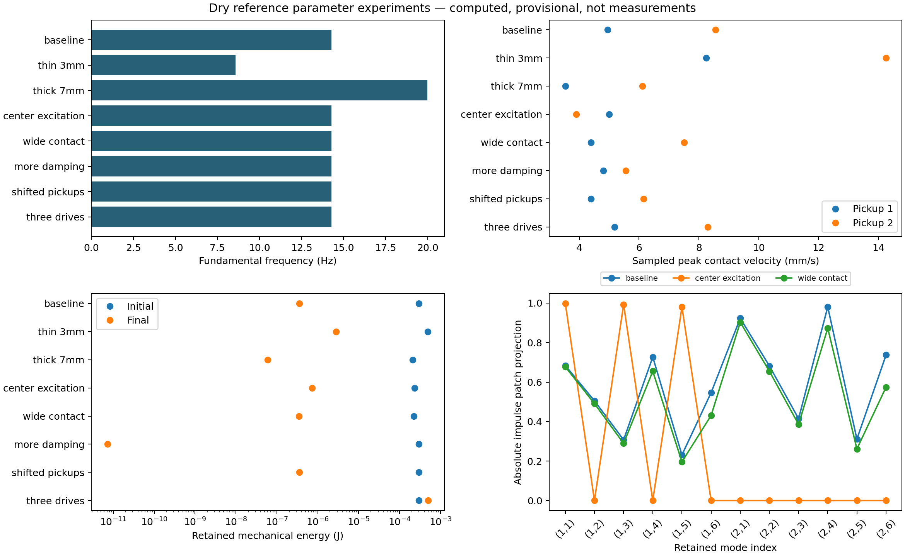

# Configurable dry-structure experiments

Working computational study, 6 October 2026. This extends the
[referenced paper](paper.md) with parameter exploration and exact configuration
replay. No physical vessel, acoustic radiation or water pressure is modeled here.

## Physical configuration and solver boundary

Configuration does not require final fabrication choices. The current reference
accepts provisional rectangular dimensions, uniform thickness, isotropic material
properties, modal damping, rigid finite excitation patches and contact pickups.
These parameters affect the response, rather than only the Blender geometry.

Geometry profile, support contacts, mounting mass/compliance, nonuniform thickness
and fill depth have explicit request fields. The analytical solver validates these
before generating results and rejects requests outside its capabilities. A curved
profile, four local supports or positive water depth cannot be interpreted as an
edge-supported dry rectangle. Adding fields records intent; it does not implement
shell/support/fluid physics. The next solver milestone remains the dry curved basin.

See the [configuration table](../../../studies/plates/001_modal_reference/README.md#parameters-and-variations)
for units and supported values. The ideal support assumption remains fixed in this
backend. Measurements later calibrate and validate assumed values; they are not
prerequisites for starting a configurable model.

## Reproduction

The eight numbered files in
[the experiment directory](../../../studies/plates/001_modal_reference/experiments/README.md)
apply small explicit changes to fresh defaults. The complete results below use
36 modes and four physical seconds in every case. The impulse magnitude remains
0.03 N·s; the wide-patch case changes area, not total impulse.

```bash
python tools/run_modal_experiments.py
python tools/plot_modal_experiments.py --output docs/research/modal_reference/figures
```

NumPy accelerates sampling when available. Plotting needs the optional `.[paper]`
dependencies; simulation/export have a standard-library fallback. In a restricted
environment, set `MPLCONFIGDIR=/tmp/spatial-sculptures-matplotlib` for plotting.

For a smaller first run, use a separate output directory:

```bash
python tools/run_modal_experiments.py --duration 0.5 --modes 4 --audio --output studies/plates/001_modal_reference/results/quick
```

That quick run has different modal truncation and observation duration; it must
not be represented as the complete four-second study reported here.

Each case writes `configuration.json`, `report.json`, `modes.csv`, `coupling.csv`
and `response.csv`. `--audio` adds a contact-pickup WAV. Reports contain parameters,
model capabilities, sampled peak/RMS velocity, energy, backend and source/config
hashes. `coupling.csv` stores the dimensionless projection of each excitation patch
and the mode shape at each pickup. Those weights explain location-dependent
observations without changing the structural basis.

Both the ordinary Python tool and Blender accept a saved `configuration.json` or
`report.json` through `--config`. This avoids relying on defaults that may change.
The Blender scene also stores the full configuration as a JSON custom property.
Runs replace generated files in the selected output directory; use `--output` to
retain separate experiments. Raw results are ignored in Git. The curated
[comparison summary](parameter_comparison.json) retains the reports and provenance
for this paper; the associated figure is intentionally retained.

Named single runs use `results/<name>/`, separately from the suite's output tree.
Comparison plotting rejects case reports that changed after the saved comparison,
so an old summary cannot silently be combined with newer modal coupling data.

## Computed results

| Case | Thickness (mm) | Reference mass (kg) | Fundamental (Hz) | Initial retained energy (J) | Final retained energy (J) | Largest sampled pickup peak (mm/s) |
| --- | ---: | ---: | ---: | ---: | ---: | ---: |
| Baseline | 5 | 67.067 | 14.279 | 0.000295563 | 3.54776e-7 | 8.5538 |
| Thin | 3 | 40.240 | 8.567 | 0.000492605 | 2.81292e-6 | 14.2566 |
| Thick | 7 | 93.893 | 19.990 | 0.000211116 | 5.94450e-8 | 6.1098 |
| Centre excitation | 5 | 67.067 | 14.279 | 0.000234574 | 7.36261e-7 | 4.9975 |
| Wide contact | 5 | 67.067 | 14.279 | 0.000221796 | 3.47465e-7 | 7.5105 |
| More damping | 5 | 67.067 | 14.279 | 0.000295563 | 7.18851e-12 | 5.5566 |
| Shifted pickups | 5 | 67.067 | 14.279 | 0.000295563 | 3.54776e-7 | 6.1512 |
| Three drives | 5 | 67.067 | 14.279 | 0.000295563 | 0.000502084 | 8.2923 |



*Computed results for the same retained basis size and observation duration.
The bottom-right panel shows absolute patch projections for twelve mode indices;
indices are ordered by the exported bank, not sorted by natural frequency.
All levels precede audio normalization.*

At fixed material and plan dimensions, the analytical formula gives frequency
proportional to thickness, and modal mass proportional to thickness. The thin/thick
results satisfy ratios 0.6 and 1.4 relative to baseline. They describe this assumed
reference, not the changing mass or frequencies of a fabricated basin.

Moving the impulse to the centre suppresses modes having either even index,
as follows directly from the sine-product shapes. Increasing the finite contact
area changes spatial modal coupling while holding total impulse fixed. Changing
damping changes the transient and retained energy; it does not change the reported
undamped natural frequencies. Moving pickups leaves the modal trajectory and
energy identical but changes the observed velocity through spatial weighting.
The harmonic-drive case receives external energy and is not a ring-down.

## Interpretation and validation

Peak/RMS values are sampled estimates on each run's dense response grid. They are
not exact continuous-time extrema or a claim that one grid resolves every possible
transient. The grid is reported, and duration changes RMS. The retained broadband
impulse response is not converged; the paper's mode-count study still applies.
The wide-contact result therefore does not establish broadband mounting accuracy.

Each optional WAV uses its own normalization gain. Listening can compare timbral
patterns, but loudness cannot compare the physical amplitudes in this table. The
signals are ideal contact velocity, not hydrophone pressure, calibrated audio or
spatial sound at a moving listener. Blender remains a magnified slow-motion
inspection view; it is not synchronized normal-speed playback of those WAVs.

Tests check thickness scaling, nodal excitation, unchanged motion after pickup
relocation, force-direction reversal with unchanged energy, saved-run numerical
and WAV replay, unsupported-physics rejection before writing outputs, and exports
without Blender, NumPy or sockets. Blender checks selected experiments and saved
configurations, mode-derived deformation, rebuild cleanup and scene preservation
on rejected settings. See [the validation record](validation.md).

References and the analytical derivation remain in [the paper](paper.md) and
[references.bib](references.bib). This parameter study adds no measured evidence
or new physical theory.
