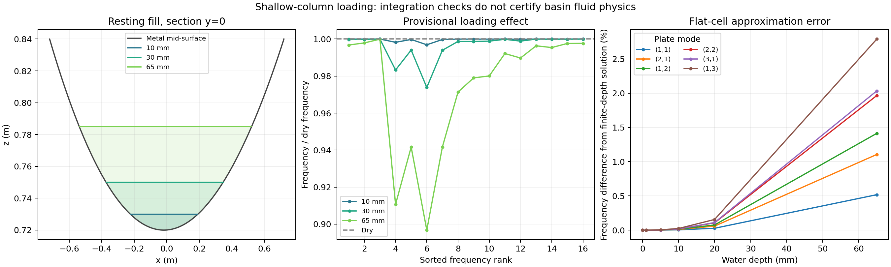

# From dry metal modes to water loading

**Working research note, version 0.1 — 8 October 2026.**

The [external dry-shell comparison](../dry_basin/external_results.md) supports one
configured dry basin over a sampled 20–200 Hz contact-response band. This study
starts water loading without transferring that certificate to a different physical
system. We implement a local inertia approximation, check its assembly and
integration, compare it with a solvable fluid reference, and compute provisional
loaded basin modes. Physical calibration remains deferred.

## 1. Assumptions and boundary

Water is treated as inviscid, incompressible and approximately irrotational.
The baseline equations are a velocity potential satisfying Laplace's equation
and linear perturbation pressure from its time derivative. MIT's
[seakeeping notes](https://ocw.mit.edu/courses/2-019-design-of-ocean-systems-spring-2011/0a8db4679928bbf62bc46addbc709432_MIT2_019S11_SK1.pdf)
describe those equations. Its
[continuum lecture notes, Section 23](https://www.ocw.mit.edu/courses/18-354j-nonlinear-dynamics-ii-continuum-systems-spring-2015/6163837c5efa5d6ed969e535ec8f890c_MIT18_354JS15_lectureNotes.pdf)
describe the gravity and surface-tension boundary conditions that a fuller
free-surface model will need.

Here we deliberately impose a pressure-release approximation at the mean top
surface: the perturbation potential is zero. We omit gravity/capillary surface
dynamics, fluid damping and static water-load prestress. This is a restricted
inertial loading problem, not the full water-filled sculpture. Near sloshing
frequencies, the omitted boundary dynamics can matter. No applicable basin
frequency range is certified by this approximation.

Python computes the model; neither reusable water math nor the reference depends
on Blender. The structural eigensystem can eventually feed the same consumers as
the dry model. This milestone exports research data and modes rather than enabling
water-loaded audio or visuals.

## 2. A finite-depth analytical reference

We derive the following reference from Laplace's equation. On a rectangular flat
bottom, prescribe unit-peak normal velocity
`S(x,y) = sin(m*pi*x/Lx) sin(n*pi*y/Ly)`. The fluid extends from `z=0` to `z=h`.
Set potential zero on the top **and vertical sides**. The sides are
pressure-release boundaries, not rigid tank walls; this artificial cell makes
the reference separable.

With `k² = (m*pi/Lx)² + (n*pi/Ly)²`, the potential for bottom velocity `V*S` is

```text
phi(x,y,z) = V*S(x,y) * sinh(k*(z-h)) / (k*cosh(k*h))
```

It satisfies the specified top/side conditions and `phi_z(x,y,0)=V*S`.
Integrating `rho*|grad(phi)|²/2` gives added mass per projected area

```text
ma(k,h) = rho*tanh(k*h)/k
ma(0,h) = rho*h
```

The sine-product modal mass contribution is `ma*Lx*Ly/4`. For an isotropic
simply supported plate with rigidity `D` and wall areal mass `mu`, the corresponding
loaded frequency is `sqrt(D*k^4/(mu+ma))/(2*pi)`.

The column approximation substitutes `rho*h` for `ma`. It is a shallow-layer
limit (`k*h` small), rather than a fitted coefficient. Finite-depth error is
reported for every reference mode and depth. Numerical refinement cannot remove
that model approximation error.

An independent optional NGSolve H1 discretization solves the three-dimensional
Laplace problem with those same boundary conditions. An affine cube map resolves
the thin cell without an isotropic mesh at the water-depth scale. Its variational
assembly follows the documented
[NGSolve elliptic-problem workflow](https://docu.ngsolve.org/latest/i-tutorials/unit-1.1-poisson/poisson.html).
It checks six added masses over three meshes against the separated solution.
This reference checks the fluid cell; it does not externally validate the
curved-basin column model.

## 3. Local loading on the basin

Let the shell graph be `z=b(x,y)` and its Cartesian wall velocity be `(vx,vy,vz)`.
To leading vertical-column order, volume flux per projected area is
`U=vz-bx*vx-by*vy`. With horizontal water level `H`, local height is
`h(x,y)=max(H-b(x,y),0)`. We use the kinetic-energy approximation

```text
Twater = (rho/2) integral_wet h(x,y)*U(x,y)^2 dx dy
```

The unnormalized graph normal and **projected XY area** matter: multiplying a
normal displacement by total water mass or isotropically adding mass to every
wall direction would implement a different model. Tangential wall motion has
zero inviscid column loading. Pure vertical translation recovers the physical
water mass. The matrix is symmetric and nonnegative by construction.

We assemble this term with the existing compact-support spline basis in bounded
batches. Only the mass matrix changes: `Mloaded=Mmetal+Mcolumn`. Supports, housing
mass and structural stiffness retain the baseline assumptions. There is no
guessed water damping or hydrostatic stiffness correction.

Depth means height above the **lowest graph point**, which gives an exact
zero-depth dry limit even for an asymmetric bowl. The fluid floor is currently
the shell mid-surface; its thickness offset is omitted. Only a flat rectangle
or strictly convex elliptical graph bowl is supported, and overflow is rejected.
The wet footprint is clipped at analytically computed shoreline/span intersections.
Integration still requires refinement checks.

## 4. Numerical evidence

The [full report](report.json) and [provenance](provenance.json) retain parameters,
checks, mode archives and source/data identities. The default study retains the
validated baseline's 18 × 18 structure and 128 modes. Its depth variants are
**provisional predictions**, without a certified water-loaded contact band.

Unit checks cover flat areal inertia, analytical parabolic-bowl volume and rigid
translation inertia, tangential motion, density scaling, matrix positivity,
asymmetric shoreline integration, rejected overflow, and exact recovery of dry
K/M at zero depth. A separate potential-energy quadrature verifies the finite-depth
formula. The CLI is exercised from another working directory with spaces in its
output path and without requiring the external solver.

The assembled flat plate's six frequencies agree with the independent column-law
formula within **0.152%** (declared limit 0.2%). For a 20 mm reference fluid cell,
NGSolve's six added masses agree with the finite-depth formula within **0.073%**
(declared limit 0.2%). These are separate assembly/reference checks.

Across the first six analytical plate modes, the largest column approximation
frequency error is about **0.0033% at 5 mm**, **0.155% at 20 mm**, and **2.79% at
65 mm**. Higher spatial wavenumbers can have larger errors. These flat-reference
numbers do not bound errors for the curved basin or account for omitted sloshing.

| Depth above lowest floor (mm) | Water mass (kg) | First ordered frequency (Hz) |
| ---: | ---: | ---: |
| 0 | 0.000 | 4.29699 |
| 10 | 0.545 | 4.29694 |
| 30 | 4.909 | 4.29564 |
| 65 | 23.053 | 4.28313 |

Ordered frequencies decrease with added nonnegative inertia, but a frequency rank
does not identify the same mode across different fills. The low support-dominated
frequencies move little; other ranks change more. Full spectra and water fractions
of modal inertia are retained in the report. We do not infer hydrophone pressure
from those fractions.

The default integration check compares order 5 / two subdivisions with order 7 /
three subdivisions. Volume, matrix and ordered-frequency differences all lie
below the separately declared 0.1% limits. This checks integration of the chosen
approximation; it is not a wet structural mesh/modal/contact convergence study.



## 5. Reproduce and next step

```bash
OPENBLAS_NUM_THREADS=1 OMP_NUM_THREADS=1 python tools/study_water_loading.py --external-plate
python tools/plot_water_loading.py
```

The basic study needs NumPy; omit `--external-plate` when NGSolve is unavailable.
Plotting additionally needs Matplotlib. Configuration lives in
[the prototype](../../../prototypes/001_resonant_surface/water_loading/README.md);
the independent [reference study](../../../studies/water/001_column_loading/README.md)
can inform other sculptures. Default artifacts are generated under ignored
`data/fem/001_resonant_surface/water_loading/`; curation checks hashes before
retaining the result and figures here.

Next, replace local columns with a **spatial potential-flow solve on the actual
basin fluid volume**. Retain the flat analytical reference, refine geometry and
fluid/structural discretization, and check water-specific contact responses.
Pressure observations then require the fluid potential and wall acceleration,
with explicitly defined sensor locations and free-surface assumptions. Add
gravity/capillary dynamics where the reference shows the pressure-release
approximation is inadequate. Enable audio/Blender consumers only after their
signals and supported band have corresponding water-specific checks.

Hydrophone pressure, acoustic radiation, water wave animation, droplets, bubbles,
viscosity, nonlinear effects, DSP feedback and physical measurements remain outside
this milestone. The staged goal is still one Python-owned physical response shared
by visualization and sound.
